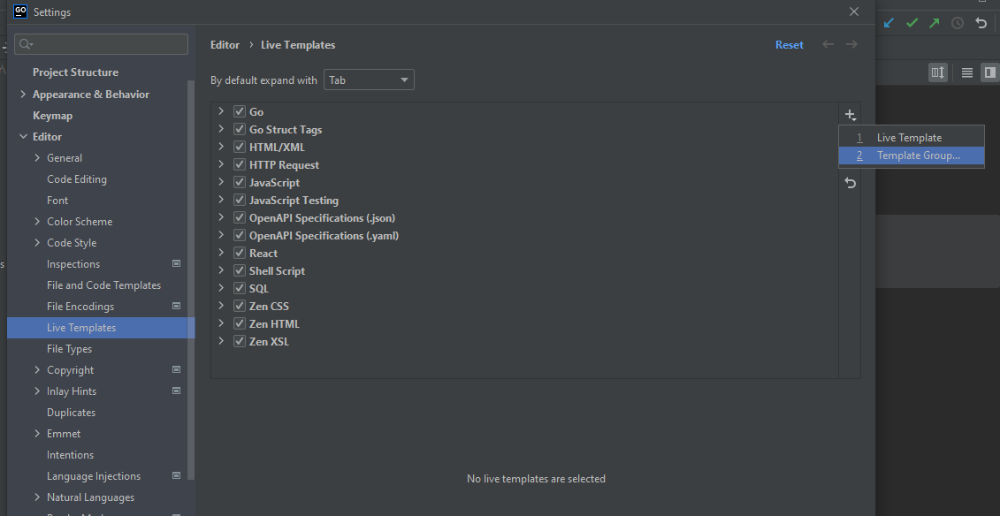
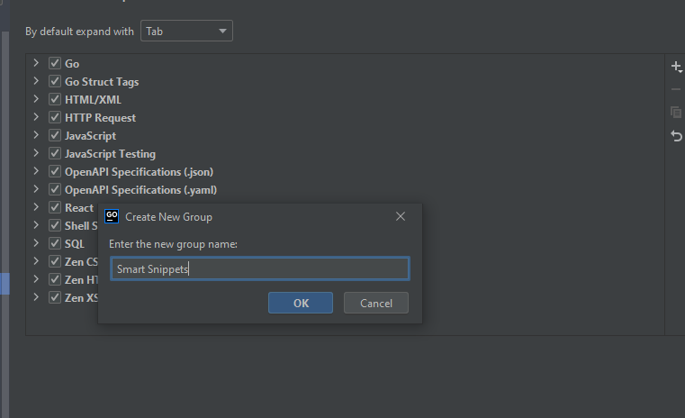
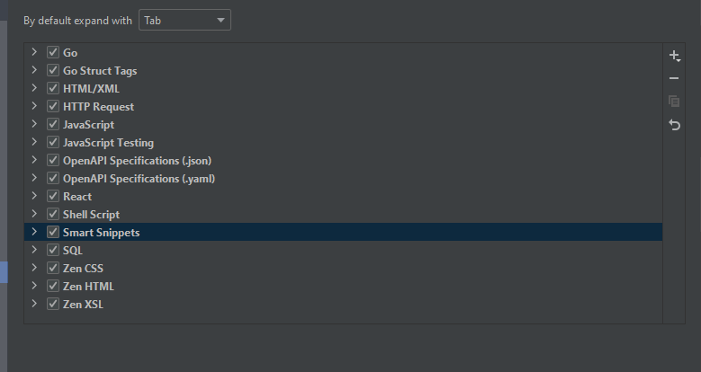
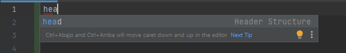
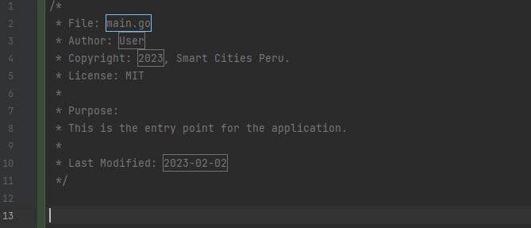

## Setup Snippet

#### First you need to open Settings or press Ctrl+Alt+s.
Open Live Templates
```
File
    -Settings
        -Editor|Live Templates
```
Create a new template group for snippets



Write a name



Copy this snippet
```
<template name="head" value="/*&#10; * File: $FILENAME$&#10; * Author: $AUTHOR$&#10; * Copyright: $YEAR$, Smart Cities Peru.&#10; * License: MIT&#10; *&#10; * Purpose:&#10; * This is the entry point for the application.&#10; *&#10; * Last Modified: $DATE$&#10; */" description="Header Structure" toReformat="false" toShortenFQNames="true">
  <variable name="FILENAME" expression="fileName()" defaultValue="main" alwaysStopAt="true" />
  <variable name="AUTHOR" expression="user()" defaultValue="me" alwaysStopAt="true" />
  <variable name="YEAR" expression="date(&quot;Y&quot;)" defaultValue="2023" alwaysStopAt="true" />
  <variable name="DATE" expression="date(&quot;Y-MM-dd&quot;)" defaultValue="2023" alwaysStopAt="true" />
  <context>
    <option name="OTHER" value="true" />
  </context>
</template>
```
Select the new template group(Smart Snippets) and paste the snippet 



Then press apply and ok

## Use 

Write ```head``` in your IDE



Then you can see the header comment


